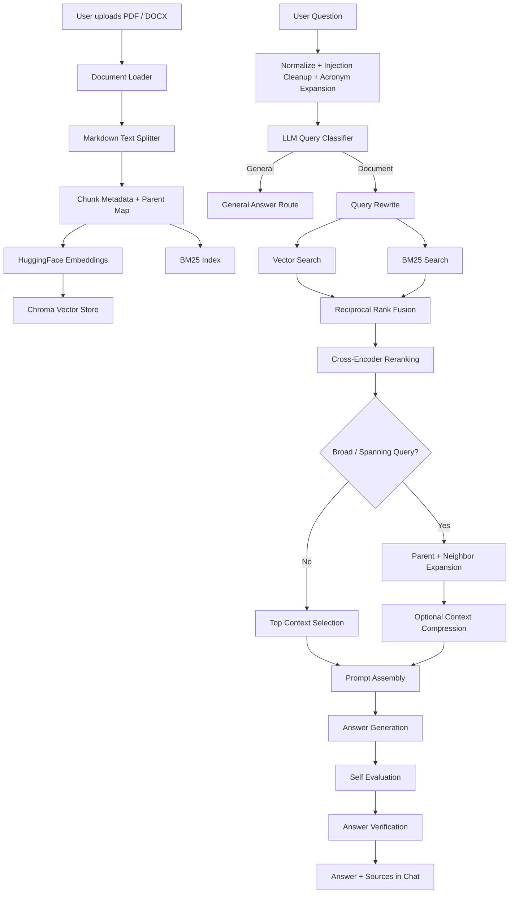

# Advanced RAG Knowledge Assistant

<p align="center">
  <b>A multi-model, self-checking RAG system that turns PDFs and Word documents into a searchable AI knowledge base.</b>
</p>

<p align="center">
  
  
  
  
  
</p>

---

## What Is This?

**Advanced RAG Knowledge Assistant** is a document-question-answering system built around a serious Retrieval-Augmented Generation pipeline. Upload `.pdf` or `.docx` files, let the app build a local knowledge base, then ask questions through a clean Gradio chat interface.

The project is not just "embed, retrieve, answer." It layers query classification, query rewriting, hybrid retrieval, reciprocal-rank fusion, cross-encoder reranking, parent-document expansion, context compression, answer verification, and LLM-as-judge evaluation into one experimental RAG playground.

---

## Why It Stands Out

- **Multi-provider model routing**: Routes tasks across Gemini, Groq, OpenRouter, and local Ollama models.
- **Hybrid retrieval**: Combines dense vector search with BM25 keyword retrieval.
- **Reciprocal Rank Fusion**: Merges vector and keyword results into a stronger candidate set.
- **Cross-encoder reranking**: Uses `cross-encoder/ms-marco-MiniLM-L-6-v2` to push the best chunks to the top.
- **Parent document retrieval**: Retrieves focused chunks, then expands to larger parent context for broad or spanning questions.
- **Context compression**: Condenses large retrieved contexts before answer generation when needed.
- **Self-evaluation and verification**: Checks whether generated answers are supported by retrieved evidence.
- **General-question routing**: Sends non-document questions to a general answer path instead of forcing document retrieval.
- **Document ingestion**: Supports PDF and DOCX uploads through the Gradio UI.
- **Evaluation utilities**: Includes benchmarking helpers for recall, MRR, keyword coverage, response time, and LLM judge scores.

---

## Architecture



---

## System Flow

1. **Upload documents**
   The app accepts multiple `.pdf` and `.docx` files, extracts their text, assigns metadata, and stores full parent-document content for later expansion.

2. **Build retrieval indexes**
   Chunks are embedded with `BAAI/bge-small-en-v1.5` and stored in Chroma. The same chunks are also tokenized into a BM25 index for keyword matching.

3. **Classify the question**
   The system decides whether the query is general or document-specific, then labels the query as factual, definition, numerical, concept, reasoning, spanning, or holistic.

4. **Rewrite and retrieve**
   Non-trivial document questions are rewritten into standalone search queries. The app runs both vector search and BM25 search, then fuses results with Reciprocal Rank Fusion.

5. **Rerank and expand**
   A cross-encoder reranks the fused candidates. For holistic or spanning questions, the app can expand retrieved chunks back to parent documents and neighboring chunks.

6. **Generate and verify**
   The final prompt instructs the LLM to answer only from retrieved context. The answer is then reviewed through self-evaluation and verification before being returned.

---

## Tech Stack

| Layer | Tools |
| --- | --- |
| UI | Gradio |
| RAG orchestration | LangChain Community, LangChain Chroma, LangChain HuggingFace, LangChain Ollama |
| Vector database | ChromaDB |
| Embeddings | HuggingFace `BAAI/bge-small-en-v1.5` |
| Keyword retrieval | rank-bm25 |
| Reranking | Sentence Transformers CrossEncoder |
| Document parsing | PyPDF, Docx2txt |
| LLM providers | Google Gemini, Groq, OpenRouter, Ollama |
| Evaluation | Custom metrics, Plotly-ready outputs, LLM judge scoring |

---

## Project Structure

```text
Adv RAG - Copy/
|-- main.py              # Main RAG pipeline, Gradio UI, evaluation helpers
|-- requirements.txt     # Python dependencies
|-- README.md            # Project documentation
|-- LICENSE              # MIT License
|-- .env.example         # Environment variable template
|-- .gitignore           # Ignored local files
`-- src/
    `-- config.py        # Loads API keys from .env
```

---

## Installation Guide

### 1. Clone The Repository

```bash
git clone https://github.com/YOUR_USERNAME/YOUR_REPO_NAME.git
cd YOUR_REPO_NAME
```

If you already have the folder locally, open a terminal inside the project directory.

### 2. Create A Virtual Environment

**Windows**

```powershell
python -m venv .venv
.venv\Scripts\activate
```

**macOS / Linux**

```bash
python3 -m venv .venv
source .venv/bin/activate
```

### 3. Install Dependencies

```bash
pip install -r requirements.txt
```

If your environment reports missing imports for provider SDKs, install these extras as well:

```bash
pip install google-genai groq streamlit
```

`streamlit` is only needed because `main.py` currently imports a Streamlit proto module at startup.

### 4. Configure Environment Variables

Copy the example environment file:

**Windows**

```powershell
copy .env.example .env
```

**macOS / Linux**

```bash
cp .env.example .env
```

Then fill in:

```env
OPENROUTER_API_KEY=your_openrouter_api_key_here
GEMINI_API_KEY=your_gemini_api_key_here
HF_TOKEN=your_huggingface_token_here
GROQ_API_KEY=your_groq_api_key_here
```

### 5. Optional: Prepare Ollama

The app uses a local Ollama model for some local tasks:

```bash
ollama pull lukaspetrik/gemma3-tools:4b
```

Make sure Ollama is running before launching the app if you keep the default local model settings.

---

## Run The App

```bash
python main.py
```

Gradio will print a local URL, usually:

```text
http://127.0.0.1:7860
```

Open it in your browser, upload one or more documents, wait for the knowledge base status message, and start asking questions.

---

## Example Workflow

```text
1. Upload:
   resume.pdf
   project-report.docx

2. App builds:
   PDF/DOCX text -> chunks -> embeddings -> Chroma vector store
   chunks -> BM25 keyword index

3. Ask:
   "Which projects mention machine learning, and what technologies were used?"

4. Pipeline:
   classify -> rewrite -> vector search + BM25 -> RRF -> rerank -> verify

5. Output:
   concise answer + source snippets
```

Example questions:

- "Summarize the uploaded document."
- "Which technologies are mentioned in the project section?"
- "What numbers, dates, or percentages appear in the document?"
- "Compare the two uploaded documents."
- "What information is missing from the document?"

---

## Evaluation Mode

`main.py` includes evaluation helpers that expect a local `test.json` file. The evaluation flow calculates:

- Retrieval recall
- Mean Reciprocal Rank
- Keyword coverage
- LLM judge accuracy
- LLM judge completeness
- LLM judge relevance
- Average response time
- Failed-question reports

The evaluation output is written to:

```text
evaluation_results.json
```

Note: this repository snapshot does not include a separate `dashboard.py`, so evaluation is currently available through the functions inside `main.py` rather than a standalone dashboard file.

---

## Configuration Flags

The top of `main.py` exposes feature switches for experimentation:

```python
ENABLE_REWRITING = True
ENABLE_SELF_REFLECTION = True
ENABLE_QUERY_REWRITE = True
ENABLE_SELF_CORRECTION = False
ENABLE_GENERAL_ROUTING = True
ENABLE_MULTI_QUERY = False
ENABLE_RERANKING = True
ENABLE_PARENT_RETRIEVAL = True
ENABLE_CONTEXT_COMPRESSION = True
ENABLE_HUMAN_CLARIFICATION = False
ENABLE_ANSWER_VERIFICATION = True
```

Use these flags to compare simple RAG against advanced retrieval, reranking, compression, and verification strategies.

---

## Troubleshooting

### Missing API Key

If the app fails during startup, check that `.env` exists and includes:

```env
OPENROUTER_API_KEY=...
GEMINI_API_KEY=...
GROQ_API_KEY=...
```

`src/config.py` raises an error when required keys are missing.

### Ollama Connection Error

Start Ollama and pull the configured model:

```bash
ollama pull lukaspetrik/gemma3-tools:4b
```

### Slow First Run

The first run may download embedding and reranking models from HuggingFace. Later launches are faster because models are cached locally.

### No Answer From Documents

Make sure you uploaded supported files, wait for "Knowledge Base Ready", and ask questions that are answerable from the uploaded content.

---

## Roadmap Ideas

- Add a dedicated evaluation dashboard.
- Persist Chroma collections between sessions.
- Add citation formatting with clickable source locations.
- Add streaming responses in the Gradio chat.
- Add toggles for retrieval strategies directly in the UI.
- Add Docker support for easier setup.

---

## License

This project is released under the MIT License. See [LICENSE](LICENSE) for details.

---

## Show Some Love

If this project helped you learn, build, evaluate, or debug a RAG system, please support it:

**Star the repository on GitHub.**

⭐ If you found this project useful, consider giving it a star on GitHub.
